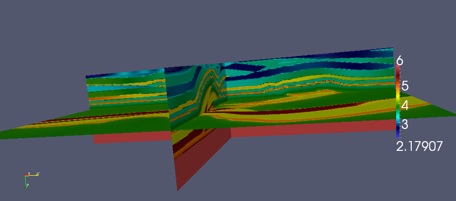

Example driver(s)
=================

**TODO: Describe ``examples/Overthrust.cpp``**

Usage ::
    
    Overthrust <nx> <ny> <nz> <omega> <px> <py> <pz> [pmlOnTop=true] [pmlSize=5] [sigma=24] [damping=7] [numPlanesPerPanel=4] [panelScheme=1] [fullViz=1] [factBlocksize=96] [solveBlocksize=64]

* `nx`, `ny`, `nz`: size of grid in each dimension
* `omega`: frequency (in rad/sec) of the problem
* `px`, `py`, `pz`: 3D process grid dimensions
* `pmlOnTop`: PML if nonzero, Dirichlet otherwise
* `pmlSize`: number of grid points per PML boundary condition
* `sigma`: magnitude of complex coordinate stretching for PML
* `damping`: imaginary frequency shift for preconditioner
* `numPlanesPerPanel`: number of planes per subdomain
* `panelScheme`: traditional approach if zero, selective inversion if 1
* `fullViz`: full volume visualization if nonzero
* `factBlocksize`: algorithmic blocksize for factorization
* `solveBlocksize`: algorithmic blocksize for solves

