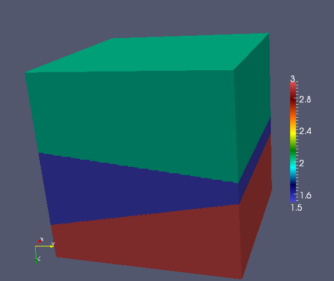

Test drivers
============

Analytical velocity models
--------------------------

0. Uniform
^^^^^^^^^^
A constant unit velocity field. This should be the ideal setting for the 
preconditioner.

.. image:: velocity-uniform.png

1. Converging lense
^^^^^^^^^^^^^^^^^^^
One of the models tested in Engquist and Ying's *Sweeping preconditioner for 
the Helmholtz equation: moving Perfectly Matched Layers*.

.. image:: velocity-gaussian.png

2. Wave guide
^^^^^^^^^^^^^
Another model tested in Engquist and Ying's *Sweeping preconditioner for 
the Helmholtz equation: moving Perfectly Matched Layers*.

.. image:: velocity-guide.png

3. Two decreasing layers
^^^^^^^^^^^^^^^^^^^^^^^^
Two layers stacked on top of each other, where the bottom layer has a velocity 
which is eight times higher than in the top layer.

.. image:: velocity-twoDecLayers.png

4. Two increasing layers
^^^^^^^^^^^^^^^^^^^^^^^^
Same as above, but the sweep proceeds from the low to high velocity (instead of 
high to low).

5. Two sideways layers
^^^^^^^^^^^^^^^^^^^^^^
Same as the above two models, but there is no gradient in the velocity model
in the sweep direction.

.. image:: velocity-twoSidewaysLayers.png

6. Five decreasing layers
^^^^^^^^^^^^^^^^^^^^^^^^^
Test the performance of sweeping from low to high velocities.

.. image:: velocity-fiveDecLayers.png

7. Five increasing layers
^^^^^^^^^^^^^^^^^^^^^^^^^
Tests the performance of sweeping from high to low velocities. Ideally, 
the sweeping preconditioner should perform worse on this model than the 
previous one since the approximated lower half-spaces should have more 
significant reflections.

.. image:: velocity-fiveIncLayers.png

8. Five sideways layers
^^^^^^^^^^^^^^^^^^^^^^^
Tests a five layer model where each panel is equivalent but heterogeneous.

9. Wedge
^^^^^^^^
A 3D version of a standard benchmark problem (**citation needed**).

10. Random
^^^^^^^^^^
Each velocity entry is drawn from a uniform distribution over :math:`[2,3]`.

.. image:: velocity-random.png

11. Separator
^^^^^^^^^^^^^
A separator with a velocity ten orders of magnitude higher than the rest 
of the medium is inserted to test the robustness of the preconditioner.
Convergence seems to be unaffected by the separator.

.. image:: velocity-separator.png

12. Cavity
^^^^^^^^^^
A high-velocity outer layer surrounding a low-velocity interior region.
Interior rays become trapped within the low-velocity region and cause resonance
(resulting in poor performance of the preconditioner).

.. image:: velocity-cavity.png

13. Reverse cavity
^^^^^^^^^^^^^^^^^^
Meant to show that high velocity contrasts are not the problem: since rays
do not become trapped, the preconditioner performs very well on this velocity
model.

.. image:: velocity-reverseCavity.png

14. Bottom half of cavity
^^^^^^^^^^^^^^^^^^^^^^^^^
If the cavity is on the bottom half of the domain, sweeping
upwards uses approximations which replace the bottom half of the cavity with 
PML, which ignores strong reflections from rays attempting to jump from the 
low to high velocity region.

15. Top half of cavity
^^^^^^^^^^^^^^^^^^^^^^
Since PSP sweeps upward from the bottom of the domain to the top, this model
should not pose a significant problem since the approximated lower half-space
problems do not replace strong with PML.

.. image:: velocity-topHalfCavity.png

UnitCube
--------
This section describes the driver 
`tests/UnitCube.cpp <https://github.com/poulson/PSP/blob/master/tests/UnitCube.cpp>`__, which is designed for quickly testing the performance of the sweeping 
preconditioner on a variety of different velocity models.

Parameters
^^^^^^^^^^
Usage ::

    UnitCube <velocity> <n> <omega> [pmlOnTop=true] [pmlSize=5] [sigma=1.5] [damping=7] [numPlanesPerPanel=4] [panelScheme=1] [fullViz=1] [factBlocksize=96] [solveBlocksize=64]

* `velocity`: which velocity field to use, see `Analytical velocity models`_
* `n`: size of grid in each dimension
* `omega`: frequency in rad/sec of problem
* `pmlOnTop`: PML or Dirichlet boundary condition on top?
* `pmlSize`: number of grid points of PML
* `sigma`: magnitude of complex coordinate-stretching for PML
* `damping`: imaginary frequency shift for preconditioner
* `numPlanesPerPanel`: number of planes per subdomain
* `panelScheme`: use normal scheme if 0, selective inversion if 1
* `fullViz`: full volume visualization if and only if nonzero
* `factBlocksize`: algorithmic blocksize for factorization
* `solveBlocksize`: algorithmic blocksize for solves

**TODO:** Describe sources and show some results.

Interpolate
-----------
The `tests/Interpolate.cpp driver <https://github.com/poulson/PSP/blob/master/tests/Interpolate.cpp>`__ 
is meant to exercise the routine 
:cpp:func:`DistUniformGrid\<F>::InterpolateTo`, which provides a means of 
linearly interpolating a velocity model into a different grid size in parallel.

Parameters
^^^^^^^^^^
Usage ::

    Interpolate <velocity> <m1> <m2> <m3> <n1> <n2> <n3>

* `velocity`: see `Analytical velocity models`_
* `m1`, `m2`, `m3`: original grid size 
* `n1`, `n2`, `n3`: interpolated grid size

**TODO:** Show some results.
